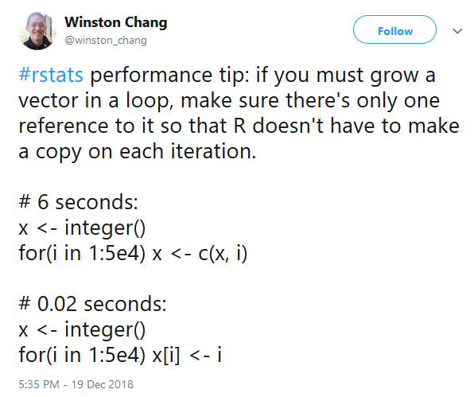

# Efficiency
As the amount of data being captured and stored continues to grow at ever increasing speed, it becomes more and more crucial to learn how to work efficiently using the tools at your disposal. Regardless of whether or not you are working with *big data*, it is important to write code that is efficient anyway. Working on analysis projects in R is often fluid and evolves dynamically according to feedback gained while exploring your data. Therefore if you work efficiently, you can get this feedback quicker and iterate through analyses more rapidly.  
  
Another aspect to efficiency is that you may not always be working with R from a powerful machine and in this case, it becomes essential to work efficiently. In addition, if many users are carrying out their work by connecting to e.g. an RStudio Server concurrently, then the server has to distribute resource to all of these users. If some users are working very inefficiently (e.g. by extracting huge amounts of data or running highly intensive processing operations) then this can cause strain on the server which can have consequences for all users that need to use the server. This can be mitigated by setting up limitations on how much server resource users can be allocated. However, it is nevertheless, important that users all try to work efficiently in order to ensure that things continue to operate smoothly.


## Extracting Data from Databases
If an organisation holds large amounts of data in databases that lots of users need to download data from then it is important for users to work with these databases in an efficient manner. The key question to ask yourself whenever you want to extract data from the database is

> What is the **minimum** amount of data I need to solve the problem?

Within this, there are some further sub-questions you should ask yourself every time.

1. What variables do I need to solve the problem? What variables do I not need? In SQL, this would be taken care of using `SELECT` and listing the variables you want to download.
2. For these variables, do I actually need all of the records in a database to solve my problem or just a subset of records? For example, do I just need records covering a particular time period? In SQL, this part is usually taken care of using `WHERE` and specifying filtering conditions.

If you think about just these questions carefully enough before extracting data, often the amount of data you actually download into R will be much smaller compared with extracting an entire database into R (particularly if the database is very large). Working with this smaller amount of data can often already result in large efficiency gains from both a memory-management and processing perspective (less data gets loaded into R and performing data processing on smaller objects can be much faster).  
  
You can go further than this and think about whether or not you can aggregate data before bringing it into R. This is a particularly good idea when extracting *non-aggregated* records would still result in extracting huge amounts of data (even after carefully considering some the questions mentioned above). In SQL, this is usually done using `GROUP BY`, combined with something like `COUNT`. If you are already familiar with SQL, you can take advantage of this in RStudio as [SQL code chunks can be used directly within RMarkdown](https://irene.rbind.io/post/using-sql-in-rstudio).

### Extracting Data from SMRA

For those working within the NHS in Scotland, Emily Moore has written a paper about [Using R with SMRA](https://github.com/Health-SocialCare-Scotland/R-Resources/blob/master/using%20SMRA%20with%20R.md) (SMRA is a large relational database containing Scottish morbidity records). This paper gives detail about how to connect to the database using RStudio and also provides guidance on making efficient queries using SQL within R.

### dbplyr

If you have the [`odbc`](https://db.rstudio.com/odbc) package set up to connect to databases, then you can use [`dbplyr`](https://db.rstudio.com/dplyr) to help you write efficient SQL queries using dplyr code. The biggest benefit here is for people who have [learned how to manipulate data using dplyr](tidyverse.html#data-manipulation-with-dplyr) but have not learned SQL. It also provides other advantages such as being able to take advantage of helper functions within dplyr (e.g. `starts_with()` to select variables) to make the amount of code you need to write more concise compared with SQL.  
  
The main idea of dbplyr is to write dplyr code as if you are just working with data that is in R already (as opposed to working with data stored in a database) but at the end, you have to add a step to actually download the data from the database into R using [`collect()`](https://dplyr.tidyverse.org/reference/compute.html). At it's core, all dbplyr does is translate code written using dplyr functions into SQL. Therefore, if you are interested in seeing the SQL code it generates, you can do so by running `show_query()`. dbplyr will likely not be able to provide all of the functionality available in SQL (at least not without inserting bits of actual SQL code in with dbplyr code) but it should be able to do what you need the majority of the time.
  
Bob Taylor has written a [short tutorial on how to use dbplyr to extract data from SMRA](dbplyr_tutorial.html). Some of this is based on a [cheatsheet of SQL-SPSS queries](https://github.com/Health-SocialCare-Scotland/SPSS-Resources/blob/master/Useful%20SQL-ISD.sps) produced by Jaime Villacampa. Encouragingly, speed tests run in the tutorial also shows that dbplyr is fast so this is a great bonus.


### Temporary Objects
Remove *temporary* objects as you go along in an analysis, particularly if those objects take up a lot of memory (e.g. temporary large dataframes). The [objectremover](https://cran.r-project.org/web/packages/objectremover/index.html) RStudio addin may help with this.


## Processing

### For Loops
Never grow a vector, preallocate the size of objects used to store results.

```r
out <- integer(50)

for (i in 1:50) {
    out[i] <- rpois(1, 10)
}
```

Use [descriptive indices](https://onunicornsandgenes.blog/2018/12/01/using-r-the-best-thing-ive-changed-about-my-code-in-years/) in loops to make them easier to understand.

```r
# First attempt
for (i in 1:ncol(geno)) {
   for (j in 1:nrow(geno)) {
        output[i,j] <- do_something(geno[j, i])
   }
}

# Second attempt
n_markers <- ncol(geno)
n_ind <- nrow(geno)
for (marker_ix in 1:n_markers) {
   for (individual_ix in 1:n_ind) {
        output[individual_ix, marker_ix] <-
            do_something(geno[individual_ix, marker_ix])
   }
}
```

If you really need to a grow a vector:




Parallel Processing [need to do some research on this, see [future](https://cran.r-project.org/web/packages/future/index.html) package].

[Rcpp](http://adv-r.had.co.nz/Rcpp.html) - loops are faster using this.


### Avoiding Loops
Avoid loops if you can, use functional programming, e.g. `purrr::map()`. **Note**: loops are not necessarily slower but leave more room for the user to write them inefficiently.


### Finding Slow Parts of Code
Profiling code - e.g. using [`profviz`](https://rstudio.github.io/profvis) (now built into the RStudio IDE)

Benchmarking - e.g. with the [`bench`](http://bench.r-lib.org) package or the [`microbenchmark`](https://cran.r-project.org/web/packages/microbenchmark/index.html) package.


## Importing and Exporting Data
For critical analyses, I still find the base R functions (e.g. `read.csv()`) to be most reliable but `readr::read_csv()` is much faster.

[vroom](https://github.com/jimhester/vroom) - package using the [ALTREP](https://svn.r-project.org/R/branches/ALTREP/ALTREP.html) framework, potentially extremely fast package for reading delimited files.

[writexl](https://cran.r-project.org/web/packages/writexl/index.html) - the fastest package for writing to Excel and has no dependencies.


## Further Resources
[Efficient R Programming by Colin Gillespie and Robin Lovelace](https://csgillespie.github.io/efficientR): This book goes into great depth on working efficiently in R.

[How to speed up R code:  an introduction](https://arxiv.org/pdf/1503.00855v1.pdf): This resource is a little old (from 2015) but still contains some useful background on how to speed up R.
